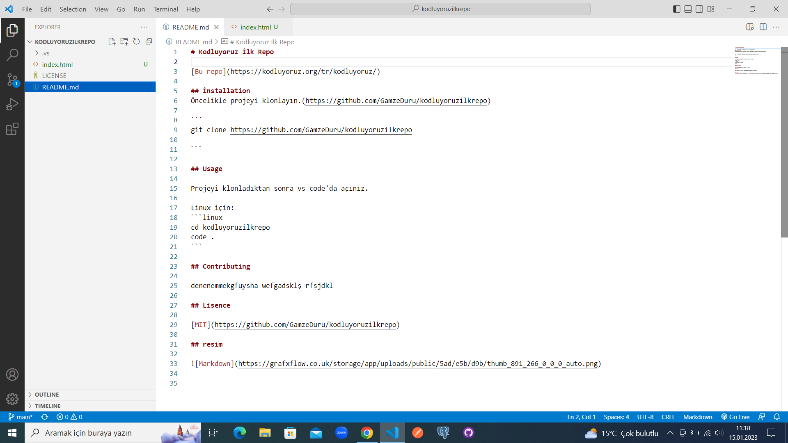

# Kodluyoruz İlk Repo
# tek şarp işareti <h1> etiketi demek

[Bu repo ilk deneme](https://kodluyoruz.org/tr/kodluyoruz/) 

## İnstallation
## iki şarp işareti <h2> etiketi demek 
Öncelikle projeyi klonlayın.(https://github.com/GamzeDuru/kodluyoruzilkrepo)

```
git clone https://github.com/GamzeDuru/kodluyoruzilkrepo

```

## Usage

Projeyi klonladıktan sonra vs code'da açınız.

Linux için:
```linux
cd kodluyoruzilkrepo
code .
```

## Contributing

denenemmekgfuysha wefgadsklş rfsjdkl

## Lisence

[MIT](https://github.com/GamzeDuru/kodluyoruzilkrepo)

## resim



### Listeleme
- deneme1
* deneme2
-  "*" ve "-" aynı işlevi görür

``` pyhton
print(x)

```
# terminalde yapılan değşşiklikleri commit etme
* git add. (tamamını commit etmek için)
* git commit -m "ilk commit"
* git push (sunucuya gönderme)

# sunucudan yapılan değişikleri içeri aktarma
* git pull
